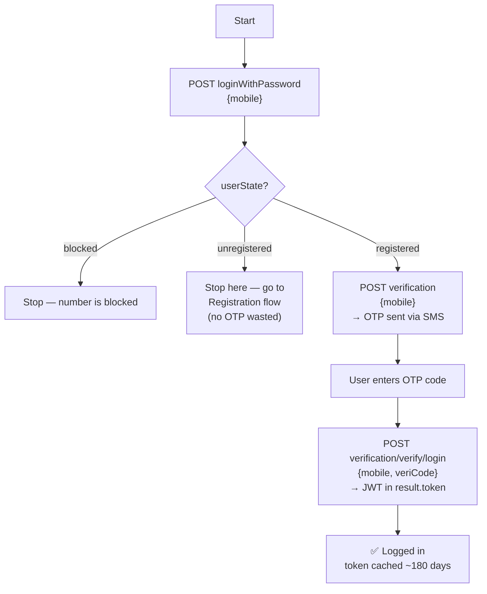
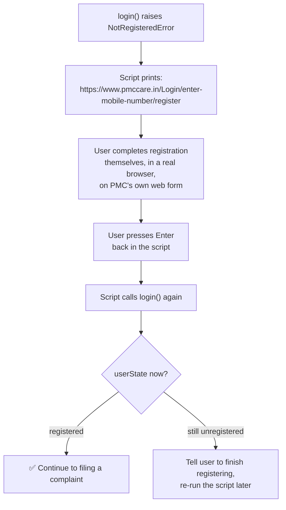
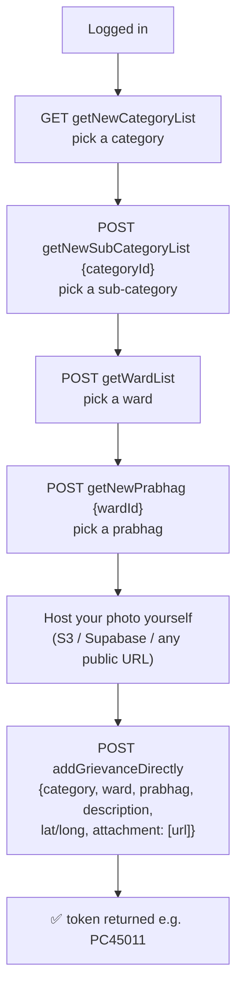
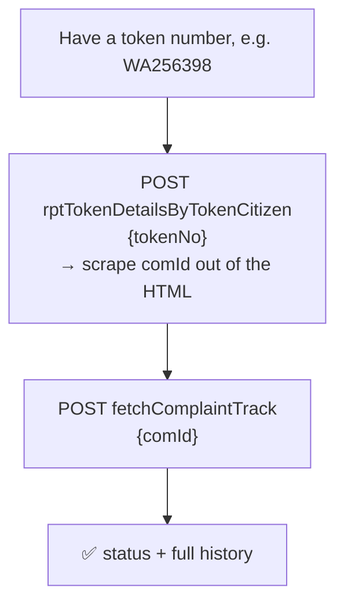

# Flow diagrams

## Login (mobile + OTP only — no password needed)

## Registration (only if `userState` comes back `unregistered`)

The script deliberately does **not** try to create the account for you. There
*is* a reverse-engineered API path for it (`register()` in the client, kept
as documented reference — see [TECHNICAL.md](TECHNICAL.md)), but it was
never live-tested and it's someone's real government-services account on the
line. Instead, the moment `unregistered` shows up, the script stops and
redirects to PMC's own real registration page — same backend, a form PMC
actually maintains and validates:

We confirmed `https://www.pmccare.in/Login/enter-mobile-number/register` is
real and live (not a guess) — its own network traffic hits the identical
`api.pmccare.in` backend, and it opens on a "नागरिक नोंदणी" (Citizen
Registration) mobile-number-and-OTP screen, matching what we found in the
app's own registration flow.

## Filing a complaint

## Checking status by token number (no login)

This is a separate, older PMC system (`complaint.pmc.gov.in`) — not
`api.pmccare.in`. It's a public token-number lookup: no login, no mobile
number, no OTP. Anyone with a token number can check its status.

