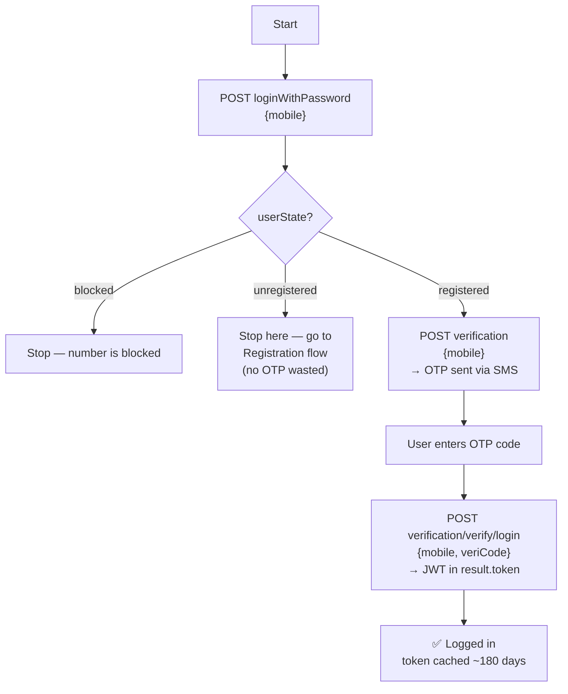
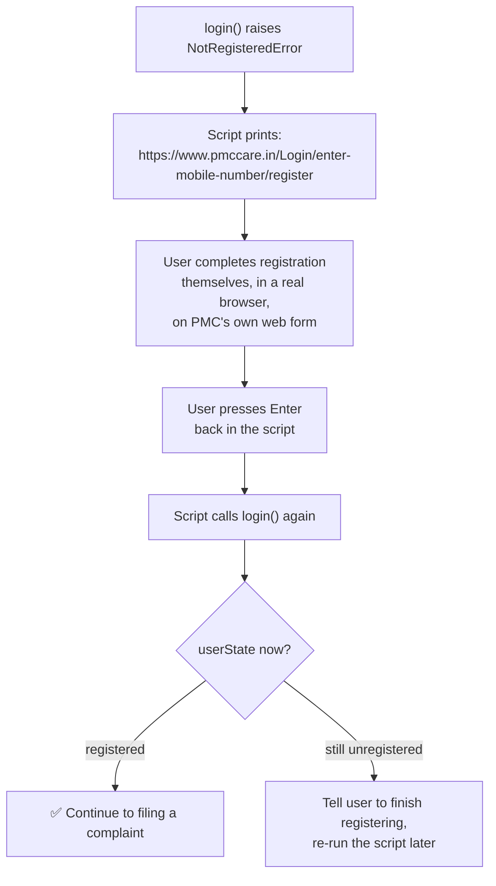
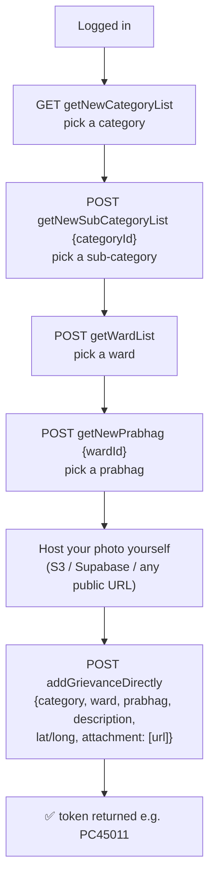
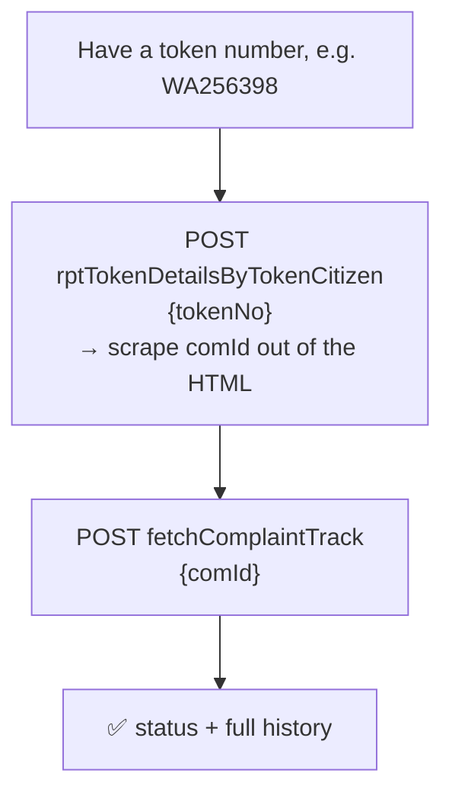

# PMC Care CLI

## What this project is?

A small Claude Code plugin + Python client to file civic complaints (potholes,
by default) to **PMC Care** (`api.pmccare.in`), the Pune Municipal
Corporation's citizen-services app — scripted, so you can walk through a
day's worth of pothole photos and report them one by one instead of doing it
by hand in the app.

It logs in as **you** (OTP, your own mobile number) and files complaints
under **your own account** — same as if you'd used the app yourself, just
batched. It does not use any credential extracted from the app, does not
touch anyone else's account, and does not silently bulk-submit — each photo
is confirmed before it's sent unless you explicitly pass `--yes`.

Every endpoint and payload shape below was either captured from our own
decrypted device traffic (Frida + mitmproxy, on our own login) or read
directly out of the app's decompiled bytecode. Nothing here is guessed from
public documentation — PMC Care doesn't publish any.

---

## Complaint, login & registration flow

### Login (mobile + OTP only — no password needed)



### Registration (only if `userState` comes back `unregistered`)

The script deliberately does **not** try to create the account for you. There
*is* a reverse-engineered API path for it (`register()` in the client, kept
as documented reference — see "For the techies"), but it was never
live-tested and it's someone's real government-services account on the
line. Instead, the moment `unregistered` shows up, the script stops and
redirects to PMC's own real registration page — same backend, a form PMC
actually maintains and validates:



We confirmed `https://www.pmccare.in/Login/enter-mobile-number/register` is
real and live (not a guess) — its own network traffic hits the identical
`api.pmccare.in` backend, and it opens on a "नागरिक नोंदणी" (Citizen
Registration) mobile-number-and-OTP screen, matching what we found in the
app's own registration flow.

### Filing a complaint



### Checking status by token number (no login)

This is a separate, older PMC system (`complaint.pmc.gov.in`) — not
`api.pmccare.in`. It's a public token-number lookup: no login, no mobile
number, no OTP. Anyone with a token number can check its status.



---

## How to run the python script

```bash
cd pmc-care-cli
pip install requests pillow cryptography
cp .env.example .env      # fill in PMCCARE_MOBILE (that's it — OTP does the rest)
```

```bash
# report a day's photos — asks before each submit, pulls GPS from EXIF,
# walks you through picking category/sub-category/ward/prabhag live
python scripts/report.py --dir ~/potholes/2026-08-04 \
    --photo-base-url https://your-bucket.example.com/potholes

# same, but skip the per-photo confirm for a batch you've already reviewed
python scripts/report.py --dir ~/potholes/2026-08-04 \
    --photo-base-url https://your-bucket.example.com/potholes --yes

# just check status of everything you've filed
python scripts/report.py --status

# check a specific complaint's status by token number — no login required
python scripts/report.py --check-token WA256398

# see every request/response while debugging (secrets are redacted)
python scripts/report.py --dir ... --debug
```

Or from Claude Code: `/report-potholes ~/potholes/2026-08-04`

**`--photo-base-url`** — your photos need to be reachable at a public URL for
PMC to store a working reference (see the technical note on `attachment.uri`
below for why). Upload the folder to any public bucket/CDN first, then point
this flag at the base URL; the script appends each photo's filename.

**First login** sends a real OTP to your phone and caches the resulting token
for ~180 days (its actual lifetime, confirmed by decoding a real token) — you
won't be asked for OTP again until it expires.

**If your number isn't registered yet**, the script won't try to register it
for you. It prints a link to PMC's own real registration page, waits for you
to press Enter after finishing it there, then tries logging in again
automatically.

---

## For the techies

Endpoint-by-endpoint breakdown with curl examples for every call the client
makes: see [TECHNICAL.md](TECHNICAL.md).
