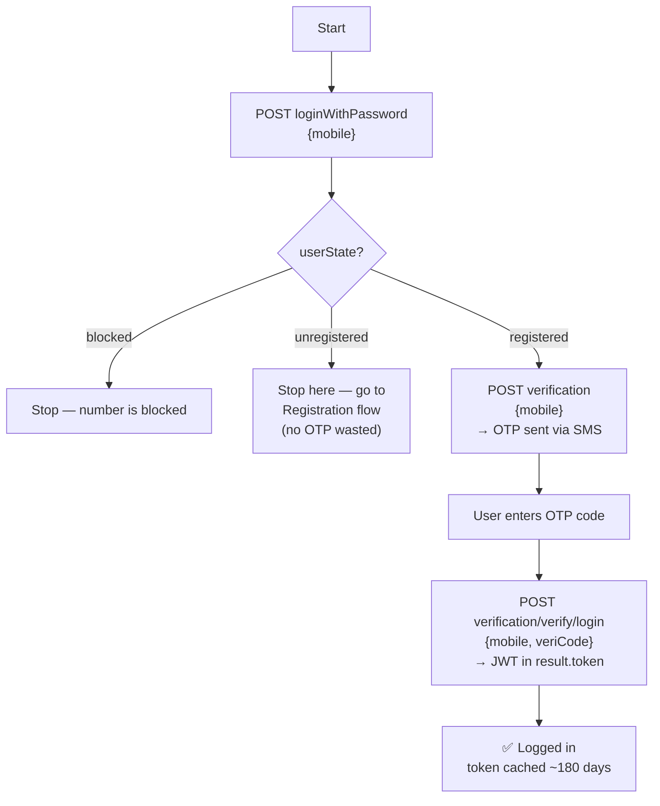
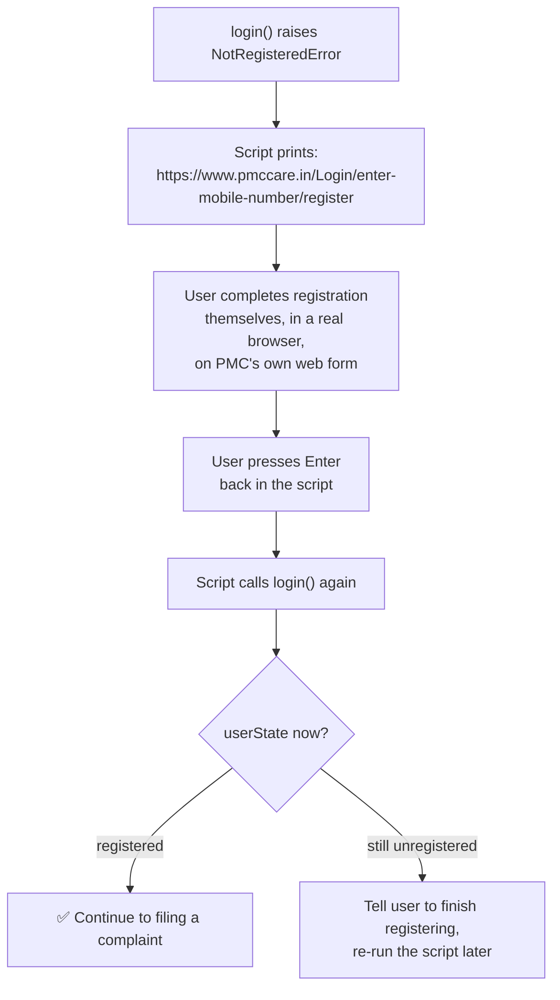
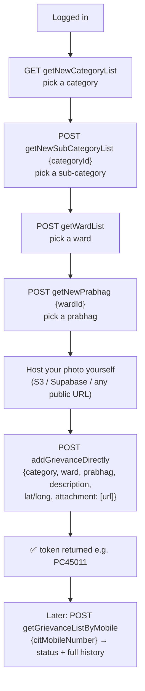

# pmc-pothole-reporter

## What this project is?

A small Claude Code plugin + Python client to file civic complaints (potholes,
by default) to **PMC Care** (`api.pmccare.in`), the Pune Municipal
Corporation's citizen-services app — scripted, so you can walk through a
day's worth of pothole photos and report them one by one instead of doing it
by hand in the app.

It logs in as **you** (OTP, your own mobile number) and files complaints
under **your own account** — same as if you'd used the app yourself, just
batched. It does not use any credential extracted from the app, does not
touch anyone else's account, and does not silently bulk-submit — each photo
is confirmed before it's sent unless you explicitly pass `--yes`.

Every endpoint and payload shape below was either captured from our own
decrypted device traffic (Frida + mitmproxy, on our own login) or read
directly out of the app's decompiled bytecode. Nothing here is guessed from
public documentation — PMC Care doesn't publish any. Confidence level is
marked per item in the code and in the technical section below.

---

## Complaint, login & registration flow

### Login (mobile + OTP only — no password needed)



### Registration (only if `userState` comes back `unregistered`)

The script deliberately does **not** try to create the account for you. There
*is* a reverse-engineered API path for it (`register()` in the client, kept
as documented reference — see "For the techies"), but it was never
live-tested and it's someone's real government-services account on the
line. Instead, the moment `unregistered` shows up, the script stops and
redirects to PMC's own real registration page — same backend, a form PMC
actually maintains and validates:



We confirmed `https://www.pmccare.in/Login/enter-mobile-number/register` is
real and live (not a guess) — its own network traffic hits the identical
`api.pmccare.in` backend, and it opens on a "नागरिक नोंदणी" (Citizen
Registration) mobile-number-and-OTP screen, matching what we found in the
app's own registration flow.

### Filing and tracking a complaint



---

## How to run the python script

```bash
cd pmc-pothole-reporter
pip install requests pillow cryptography
cp .env.example .env      # fill in PMCCARE_MOBILE (that's it — OTP does the rest)
```

```bash
# report a day's photos — asks before each submit, pulls GPS from EXIF,
# walks you through picking category/sub-category/ward/prabhag live
python scripts/report.py --dir ~/potholes/2026-08-04 \
    --photo-base-url https://your-bucket.example.com/potholes

# same, but skip the per-photo confirm for a batch you've already reviewed
python scripts/report.py --dir ~/potholes/2026-08-04 \
    --photo-base-url https://your-bucket.example.com/potholes --yes

# just check status of everything you've filed
python scripts/report.py --status

# see every request/response while debugging (secrets are redacted)
python scripts/report.py --dir ... --debug
```

Or from Claude Code: `/report-potholes ~/potholes/2026-08-04`

**`--photo-base-url`** — your photos need to be reachable at a public URL for
PMC to store a working reference (see the technical note on `attachment.uri`
below for why). Upload the folder to any public bucket/CDN first, then point
this flag at the base URL; the script appends each photo's filename.

**First login** sends a real OTP to your phone and caches the resulting token
for ~180 days (its actual lifetime, confirmed by decoding a real token) — you
won't be asked for OTP again until it expires.

**If your number isn't registered yet**, the script won't try to register it
for you. It prints a link to PMC's own real registration page, waits for you
to press Enter after finishing it there, then tries logging in again
automatically.

---

## For the techies

Base URL: `https://api.pmccare.in`. Auth header on every authenticated call:
`authorization: jwt <token>` — note lowercase header key and `jwt` scheme,
**not** `Authorization: Bearer`.

### `check_mobile(mobile)` — LIVE-CONFIRMED
Checks whether a number is registered, before sending any OTP.

```bash
curl -s -X POST https://api.pmccare.in/authenticationConfiguration/v1/loginWithPassword \
  -H 'Content-Type: application/json' \
  -d '{"mobile":"+91XXXXXXXXXX","facebookId":null,"googleId":null,"twitterId":null}'
# -> {"code":200,"result":{"mobile":"+91XXXXXXXXXX","userState":"registered"},...}
```

### `request_otp(mobile)` — LIVE-CONFIRMED
Same call for both registered and unregistered numbers.

```bash
curl -s -X POST https://api.pmccare.in/authenticationConfiguration/v1/verification \
  -H 'Content-Type: application/json' \
  -d '{"mobile":"+91XXXXXXXXXX"}'
# -> {"code":200,"result":{},"message":"generateVerfCode",...}
```

### `verify_otp(code, mobile)` — LIVE-CONFIRMED
Returns the JWT in `result.token` (not a response header). Also carries the
full citizen profile (`firstName`, `emailId`, `userId`, etc.) in the same
response — we cache those alongside the token so later calls (like filing a
complaint) don't need a second lookup.

```bash
curl -s -X POST https://api.pmccare.in/authenticationConfiguration/v1/verification/verify/login \
  -H 'Content-Type: application/json' \
  -d '{"mobile":"+91XXXXXXXXXX","veriCode":"1234","fcmToken":""}'
# -> {"code":200,"result":{"token":"<JWT>","userId":"U...","userState":"registered",...}}
```

### `register(...)` — CODE-CONFIRMED payload, NOT live-tested, NOT wired into login()
Read directly out of the app's decompiled bytecode (Hermes bytecode →
`hermes-dec`), never exercised live (deliberately, to avoid creating a spare
account). The password field is AES-128-CBC "encrypted" with a **hardcoded
key that doubles as the IV** (`0123456789abcdef0123456789abcdef`, same for
every install) — worth knowing this isn't real encryption, but the server
expects the field in this form.

`login()` never calls this. When a number comes back `unregistered`, the
script stops and points at `REGISTRATION_URL`
(`https://www.pmccare.in/Login/enter-mobile-number/register`) instead — a
real, PMC-maintained web form on the same backend. That form is the actual
recommended path; `register()` stays here only as a documented reference for
anyone who wants to verify/use it themselves.

```bash
curl -s -X POST https://api.pmccare.in/user/v1/registerUser \
  -H 'Content-Type: application/json' \
  -d '{
    "firstName":"<NAME>","middleName":"","lastName":"",
    "gender":"<GENDER>","DOB":"<YYYY-MM-DD>","mobile":"+91XXXXXXXXXX",
    "address":"","lat":0,"long":0,"emailId":"<EMAIL>",
    "password":"<AES-CBC ciphertext, base64, hardcoded key>",
    "fcmToken":"","sourceLocation":"android","createdSource":"Device",
    "mobileDeviceToken":"","lang":"en","MUID_REG":"","channelId_REG":"",
    "EVENT_TYPE":"REG","referedBy":""
  }'
```

### `categories()` / `subcategories(id)` / `wards()` / `prabhags(ward_id)` — LIVE-CONFIRMED

```bash
curl -s https://api.pmccare.in/user/v1/GrievanceCtrl/getNewCategoryList \
  -H 'authorization: jwt <JWT>'

curl -s -X POST https://api.pmccare.in/user/v1/GrievanceCtrl/getNewSubCategoryList \
  -H 'authorization: jwt <JWT>' -H 'Content-Type: application/json' \
  -d '{"categoryId":"48"}'

curl -s -X POST https://api.pmccare.in/user/v1/getWardList \
  -H 'authorization: jwt <JWT>'

curl -s -X POST https://api.pmccare.in/user/v1/GrievanceCtrl/getNewPrabhag \
  -H 'authorization: jwt <JWT>' -H 'Content-Type: application/json' \
  -d '{"wardId":"6"}'
```

### `submit_complaint(...)` — LIVE-CONFIRMED endpoint/shape

```bash
curl -s -X POST https://api.pmccare.in/user/v1/GrievanceCtrl/addGrievanceDirectly \
  -H 'authorization: jwt <JWT>' -H 'Content-Type: application/json' \
  -d '{
    "userId":"<USER_ID>","citMobileNumber":"+91XXXXXXXXXX",
    "citEmail":"<EMAIL>","citFirstName":"<NAME>","citMiddleName":"NA","citLastName":"NA",
    "categoryDetailId":252,"categoryId":48,
    "wardOfficeId1":4,"gisWardName":"<WARD>",
    "prabhagId1":70,"gisPrabhagName":"<PRABHAG>",
    "pethId1":null,"gisPethName":"Select",
    "description":"<TEXT>","currentLocation":"Pune","location":"<ADDRESS>",
    "landmark":"","latitude":18.0,"longitude":73.0,
    "image":"","image1":"",
    "attachment":[{"type":"image","uri":"<YOUR PUBLIC PHOTO URL>"}],
    "applicationType":1,"startFrom":"","handleAt":"","artId":1,"startArtId":1
  }'
# -> {"code":200,"result":"PC45011","message":"Girevance added successfully"}
```

**Why `attachment.uri` is a plain URL and not an upload.** The official app
uploads photos via a separate multipart call (`POST
/objectStorage/v1/storeObject`), gets back a real PMC-hosted CDN URL — then a
confirmed bug in the app's own code discards that URL and submits a
**device-local `file://` path** instead. We verified this by pulling our own
filed complaint straight back from the server: the stored `attachment[].uri`
was that same meaningless local path, accepted with no validation at all.
Since the server evidently doesn't check this field, we skip the upload step
entirely and put a real, publicly-fetchable URL there instead — which
actually works *better* than the app's own current behavior, since ward
staff can never see the app's local-path attachments at all.

### `my_complaints()` — LIVE-CONFIRMED

```bash
curl -s -X POST https://api.pmccare.in/user/v1/GrievanceCtrl/getGrievanceListByMobile \
  -H 'authorization: jwt <JWT>' -H 'Content-Type: application/json' \
  -d '{"citMobileNumber":"+91XXXXXXXXXX"}'
```

### Other things worth knowing
- **Token lifetime: 180 days**, decoded from a real JWT's `iat`/`exp`. The
  identity payload itself is inside an opaque `encryptedData` blob only the
  server can read — the JWT is a pure bearer credential.
- **Uploaded photos are served with no auth at all.** `GET /image/v1/...`
  requires no token, no cookie — anyone with the URL (which embeds your
  `userId`) can view it. Treat these as public links.
- Not everything the app calls uses `api.pmccare.in` directly — the endpoint
  routing table itself is fetched at runtime from `GET
  /applicationConfig/v1/appConfiguration/getApidetails`, which is why several
  endpoint names in the bundle's static strings (e.g. the old
  `GrievanceCtrl/addGrievance`) turned out to be stale/unused — the real one
  in current traffic is `addGrievanceDirectly`.
